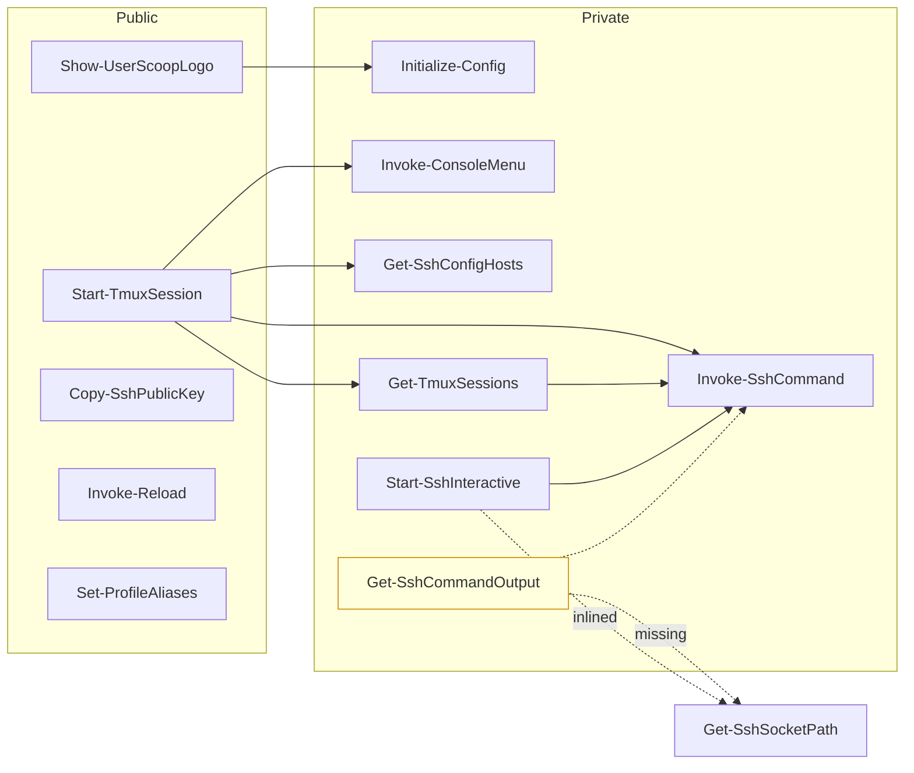

# ShellPrompt 代码精简方案

> 范围: `c:/Users/33098/Documents/PowerShell`
> 仅做方案设计，不修改任何源码。
> 约束:
> - PowerShell 导出函数(`.psd1` 中 `FunctionsToExport`)默认保留签名
> - `CHANGELOG.md` / `LICENSE` / `README*.md` / `output/diag-istoreos.ps1` / `data/quotes.txt` / `powershell.config.json` 不动
> - 风险等级: **高** = 影响导出 API / 模块对外行为; **中** = 影响内部行为/状态; **低** = 纯代码美化/注释清理

---

## 1. 冗余代码清单

### 1.1 未被引用的函数 / 死代码

| # | 项 | 位置 | 说明 | 推荐处理 |
|---|----|------|------|----------|
| R-01 | `Test-TmuxAvailable` 薄包装 | [`ShellPrompt/Private/Get-TmuxSessions.ps1:85`](ShellPrompt/Private/Get-TmuxSessions.ps1:85) | 仅一个调用方: 函数自身的注释说"向后兼容",但全仓 grep 没有任何调用点;同时 [`Start-TmuxSession.ps1:66`](ShellPrompt/Public/Start-TmuxSession.ps1:66) 也已切到 `Get-TmuxAvailability` | 删除 |
| R-02 | `Start-SshInteractive` 末尾的 `Export-ModuleMember` | [`ShellPrompt/Private/Start-SshInteractive.ps1:89`](ShellPrompt/Private/Start-SshInteractive.ps1:89) | `ShellPrompt.psd1` 的 `FunctionsToExport` 未包含 `Start-SshInteractive`,模块入口 [`ShellPrompt.psm1:45`](ShellPrompt/ShellPrompt.psm1:45) 也未导出;此处 `Export-ModuleMember` 在 Private 脚本里毫无作用 | 删除该行 |
| R-03 | `_SshSocketResolver` 反射缓存分支 | [`ShellPrompt/Private/Get-SshCommandOutput.ps1:39-44`](ShellPrompt/Private/Get-SshCommandOutput.ps1:39) | 缓存 `Get-Command Get-SshSocketPath` 的 CommandInfo,但全仓 grep `Get-SshCommandOutput` **零调用点**;且依赖的 `Get-SshSocketPath` 函数本就不存在(只在 `Start-SshInteractive` 内联使用) | 若决定删除 R-04,可同步删除整个 `Get-SshCommandOutput.ps1` |
| R-04 | 整个 `Get-SshCommandOutput` 函数 | [`ShellPrompt/Private/Get-SshCommandOutput.ps1:10`](ShellPrompt/Private/Get-SshCommandOutput.ps1:10) | 同上,无人调用;且 `Get-TmuxAvailability` 走的是 `Invoke-SshCommand -CaptureOutput` 路径,不经过本函数 | 删除整个文件 |
| R-05 | `_tmp/` 空目录 | [`_tmp/`](_tmp) | 列出来只剩一个目录壳,无文件(连 `.gitignore` 都已被删) | 删除目录 |
| R-06 | `output/_patch/Get-TmuxSessions.patch.md` | [`output/_patch/`](output/_patch) | 上一次 `Get-TmuxSessions` 改动的临时补丁文件,改已合并,留之无义 | 删除文件 |
| R-07 | `.gitnexus/lbug` 二进制数据库 | [`.gitnexus/lbug`](.gitnexus/lbug) | 与 `.gitnexus/parse-cache/index.json` 一样是 gitnexus 工具的本地索引缓存,已在 `.gitignore` 体系下,不会入库 | 保留(工具产物),不入精简批次 |

### 1.2 重复实现的逻辑

| # | 项 | 位置 | 说明 | 推荐处理 |
|---|----|------|------|----------|
| D-01 | `Reset-TerminalMode` 双重定义 | [`ShellPrompt/Private/Invoke-SshCommand.ps1:6-15`](ShellPrompt/Private/Invoke-SshCommand.ps1:6) + [`ShellPrompt/Private/Start-SshInteractive.ps1:4-12`](ShellPrompt/Private/Start-SshInteractive.ps1:4) | 两份实现同名但**实现完全不同**: `Invoke-SshCommand` 版写 ANSI 转义,`Start-SshInteractive` 版读写 `$script:Original*` 状态。同一概念两套实现,且两函数都只在 `finally` 内自用 | 抽到一个 `Private/Reset-TerminalMode.ps1`,两处 `finally` 都调用;统一以 `$script:Original*` 为权威状态(与 `Start-SshInteractive` 一致) |
| D-02 | `Get-SshSocketPath` 调用 + socket 缓存逻辑写 3 遍 | [`Get-SshCommandOutput.ps1:39-61`](ShellPrompt/Private/Get-SshCommandOutput.ps1:39) / [`Start-SshInteractive.ps1:34-47`](ShellPrompt/Private/Start-SshInteractive.ps1:34) / `Get-SshSocketPath` 函数本身 | 三个地方各自维护 `socket` 路径查找 + 缓存键;其中 `Get-SshCommandOutput` 调用一个**根本未实现**的 `Get-SshSocketPath` | 收敛到单一 `Get-SshSocketPath -HostName` 函数 + `$script:SshSocketCache` 缓存,其余两处直接 `Get-SshSocketPath` |
| D-03 | 终端编码保存/恢复样板 | [`Start-SshInteractive.ps1:68-73 + 77`](ShellPrompt/Private/Start-SshInteractive.ps1:68) + [`Invoke-SshCommand.ps1:174-215`](ShellPrompt/Private/Invoke-SshCommand.ps1:174) | 同样 3 步: 保存 `OutputEncoding`/`InputEncoding`/`TERM` → 设 UTF8 + `xterm-256color` → `finally` 恢复;两边实现几乎相同 | 与 D-01 共用 `Reset-TerminalMode` |
| D-04 | `ssh-copy-id` 别名双重声明 | [`Microsoft.PowerShell_profile.ps1:66`](Microsoft.PowerShell_profile.ps1:66) + [`ShellPrompt/Public/Set-ProfileAliases.ps1:8`](ShellPrompt/Public/Set-ProfileAliases.ps1:8) | profile 用 `Set-Alias -Scope Global -Force`(全局,薄壳场景可见),`Set-ProfileAliases` 用模块作用域别名(模块加载后内部可见);注释也自承这种 split 是有意为之 | 保留两者分工(全局 / 模块内),但 `Set-ProfileAliases` 那一行建议加注释说明"模块内别名,全局走 profile" |
| D-05 | `ll` / `which` 别名双声明 | [`Microsoft.PowerShell_profile.ps1:16-17`](Microsoft.PowerShell_profile.ps1:16) + [`ShellPrompt/Public/Set-ProfileAliases.ps1:6-7`](ShellPrompt/Public/Set-ProfileAliases.ps1:6) | profile 在模块加载前先注册全局别名,模块加载后 `Set-ProfileAliases` 再注册模块作用域别名;后者会被前者覆盖,无附加价值 | 删除 `Set-ProfileAliases.ps1` 中 `ll` / `which` 两行,仅保留 `ssh-copy-id` |
| D-06 | `$Global:UserScoop_CONF` / `$Global:UserScoop_ROOT` 旧全局别名 | [`ShellPrompt/Private/Initialize-Config.ps1:41-48`](ShellPrompt/Private/Initialize-Config.ps1:41) | 注释说"向后兼容";`Get-ConfigValue` 实现确实会回退到 `$global:UserScoop_CONF`,但 grep 仓库内**没有任何外部读取**;只此一处赋值 + 一处回退判定 | 在 `Get-ConfigValue` 中直接删 `$global:UserScoop_CONF` 分支,仅保留 `$script:Config` + `Default` 两层 |
| D-07 | `Get-ConfigValue` 与 `Get-CachedConfig` 双层入口 | [`ShellPrompt/Private/Initialize-Config.ps1:67`](ShellPrompt/Private/Initialize-Config.ps1:67) + [`ShellPrompt/Private/Initialize-Config.ps1:108`](ShellPrompt/Private/Initialize-Config.ps1:108) | 内部注释说"公共调用仍可继续使用 `Get-ConfigValue`",但实际 grep 仓库**零调用方**;所有调用方都用 `Get-CachedConfig` | 把 `Get-ConfigValue` 函数体并入 `Get-CachedConfig` 的 fallback 路径,删除独立函数;`Get-CachedConfig` 重命名为 `Get-Config`(或保留 `Get-CachedConfig`) |
| D-08 | `ColorHighlight` 参数永远回退到 `Rst` | [`ShellPrompt/Private/Invoke-ConsoleMenu.ps1:44-47`](ShellPrompt/Private/Invoke-ConsoleMenu.ps1:44) | 注释自承"MintGreen 在新配置中已移除;此处回退到 reset";且所有调用方都未传 `-ColorHighlight` | 直接删 `-ColorHighlight` 参数,把对应插值换成 `$rst` |
| D-09 | `sshArgs.ToArray() -join ' '` 引号转义 vs `ArgumentList` 预分配 | [`ShellPrompt/Private/Invoke-SshCommand.ps1:108-119`](ShellPrompt/Private/Invoke-SshCommand.ps1:108) + [`ShellPrompt/Private/Get-SshCommandOutput.ps1:65-88`](ShellPrompt/Private/Get-SshCommandOutput.ps1:65) | 同一段"ssh 参数构建"在两个文件里有两套不同实现(一个手工引号包裹,一个用 `ArgumentList`),语义不一致 | 统一为 `Generic.List[string]` + `ArgumentList`(若保留 `Get-SshCommandOutput`);但鉴于 R-04,本项可与 R-04 一起收敛 |

### 1.3 永不执行的分支 / 死代码片段

| # | 项 | 位置 | 说明 | 推荐处理 |
|---|----|------|------|----------|
| X-01 | `$Global:LastSshHost` 置顶判断里的 `$Global:LastSshHost` 首次空值场景 | [`ShellPrompt/Public/Start-TmuxSession.ps1:37-39`](ShellPrompt/Public/Start-TmuxSession.ps1:37) | `if ($Global:LastSshHost -and ($hosts -contains ...))` 中 `LastSshHost` 初值 `$null`,首次执行走 else 分支,逻辑正确,无问题。**此项实为正常路径,非死代码**,仅记录以澄清 | 保留 |
| X-02 | `if (-not $Keys)` 永远不会为真 | [`ShellPrompt/Private/Invoke-ConsoleMenu.ps1:48-56`](ShellPrompt/Private/Invoke-ConsoleMenu.ps1:48) | 该函数只被 `Start-TmuxSession` 与 `Show-UserScoopLogo` 自身调用,均未传 `-Keys`;看似"防御性默认值"可保留 | 保留,标记为防御性 |
| X-03 | `if ($env:SUDO_USER)` 块 | [`ShellPrompt/Private/Start-SshInteractive.ps1:11`](ShellPrompt/Private/Start-SshInteractive.ps1:11) | `$env:SUDO_USER` 在 Windows PowerShell 5.1 上**几乎永远为 `$null`**;`Remove-Item Env:TERM` 这行实际很少触发 | 与 D-01 合并到统一 `Reset-TerminalMode` 时,内联为 1 行 `try { Remove-Item Env:TERM -EA SilentlyContinue } catch {}` |
| X-04 | `MintGreen` 颜色引用残留 | [`ShellPrompt/Private/Invoke-ConsoleMenu.ps1:45`](ShellPrompt/Private/Invoke-ConsoleMenu.ps1:45) 注释中 + D-08 | 注释里说"在新配置中已移除",但仓库内已无 `MintGreen` 字符串;只是注释/参数还留着 | 与 D-08 一并处理 |

### 1.4 过时注释 / TODO / 历史包袱

| # | 项 | 位置 | 说明 | 推荐处理 |
|---|----|------|------|----------|
| C-01 | `Get-SshSocketPath` 函数全仓不存在但被引用 | [`Get-SshCommandOutput.ps1:42`](ShellPrompt/Private/Get-SshCommandOutput.ps1:42) + [`Start-SshInteractive.ps1:40`](ShellPrompt/Private/Start-SshInteractive.ps1:40) + CHANGELOG 提及 | `Start-SshInteractive` 注释第 2 行还把 `Get-SshSocketPath` 当已知函数宣传 | 与 D-02 同步修复(抽出真实函数) |
| C-02 | CHANGELOG 与现状严重脱节 | [`ShellPrompt/CHANGELOG.md`](ShellPrompt/CHANGELOG.md) | 提到 `TUILogger.ps1` / `TUIPerformanceState.ps1` / `Initialize-Environment.ps1` / `Get-MultiplexerSessions` / `Test-MultiplexerAvailable` / `Merge-Hashtable` / `Write-TUILog` / `ConvertFromJsonCompat` 等,但**当前代码中均不存在**;同时 .gitnexus `meta.json` 也把这些文件列入 `fileHashes` 索引 | 任务约束"不修改 CHANGELOG.md",但**建议在 PR 描述/issue 中标注**:CHANGELOG 中"Added/Changed/Reverted"段需要重写。建议在精简方案文档顶部加一节"文档同步建议" |
| C-03 | `.gitnexus/meta.json` `fileHashes` 已陈旧 | [`.gitnexus/meta.json:31-58`](.gitnexus/meta.json:31) | 索引了 21 个文件,但 11 个已不存在(`WaterReminder/*`、`TUILogger.ps1`、`TUIPerformanceState.ps1` 等);留下的 12 个文件 hash 大概率也已过期 | 由 `gitnexus` 工具下次自动重生成;手动可删 `meta.json` + `parse-cache/index.json` 触发重建 |
| C-04 | 注释中的内部叙事过详 | 多处,如 [`Get-TmuxSessions.ps1:36-43`](ShellPrompt/Private/Get-TmuxSessions.ps1:36) / [`Invoke-SshCommand.ps1:84-107`](ShellPrompt/Private/Invoke-SshCommand.ps1:84) | 大量"修 2026-06-27 / 死锁修复 / 性能优化"等历史叙述,占空间且对维护价值递减 | 收敛为 1-2 行"为什么这样做"的核心注释 |
| C-05 | 文件头注释提及已删除的"Stage 2.x"阶段 | [`Get-SshCommandOutput.ps1:1-9`](ShellPrompt/Private/Get-SshCommandOutput.ps1:1) | "Stage 2.1.a / Stage 2.2 hook" 是早期路线图,已与现状脱节 | 简化为 1-2 行功能描述 |
| C-06 | `Test-Path + Get-Item` 双调用未合并 | [`Get-SshConfigHosts.ps1:11-16`](ShellPrompt/Private/Get-SshConfigHosts.ps1:11) / [`Show-UserScoopLogo.ps1:35-38`](ShellPrompt/Public/Show-UserScoopLogo.ps1:35) | CHANGELOG 第 32 行声称"合并为单次 `Get-Item`",但实际两个文件都仍是 `Test-Path` + `Get-Item` 两步 | 合并为 `Get-Item -ErrorAction SilentlyContinue` 一次调用 |
| C-07 | `Get-SshCommandOutput.ps1` 头部 BMP 注释 | [`Get-SshCommandOutput.ps1:8`](ShellPrompt/Private/Get-SshCommandOutput.ps1:8) | "性能优化: Generic.List 预分配 / ControlPath 模块级缓存" 提到 ControlPath 缓存,但文件实际**没有实现** ControlPath 缓存,只是接收 `$ControlPath` 入参 | 与 R-04 同步删除整个文件 |

---

## 2. 精简建议(按优先级)

### 🔴 P0 — 高优先级(可能影响行为,需先验证)

| 序 | 项 | 位置 | 风险 | 推荐处理 | 预估收益 |
|---|----|------|------|----------|----------|
| P0-1 | 删除 `Get-SshCommandOutput.ps1` 整文件 | [`Private/Get-SshCommandOutput.ps1`](ShellPrompt/Private/Get-SshCommandOutput.ps1) | **高**(若外部脚本直接 import 该函数会断) | 先 `git grep -r "Get-SshCommandOutput"` 确认无调用方(当前已确认无),删除文件 | -60 行;同时消除 3 处隐式依赖(`Get-SshSocketPath` / `_SshSocketResolver` / `_SshSocketPathCache`) |
| P0-2 | 抽真实 `Get-SshSocketPath` 函数 | `Private/Get-SshSocketPath.ps1`(新) | **高**(被 `Start-SshInteractive` 显式调用) | 把 [`Start-SshInteractive.ps1:35-47`](ShellPrompt/Private/Start-SshInteractive.ps1:35) 的 socket 查找+缓存逻辑提取为 `Get-SshSocketPath -HostName` 函数,返回 `{ Path, Persist }` 对象 | 消除 D-02 / C-01 |
| P0-3 | 统一 `Reset-TerminalMode` | `Private/Reset-TerminalMode.ps1`(新) | **中**(终端恢复路径错误会留颜色/光标异常) | 以 `Start-SshInteractive` 版本为基准(基于 `$script:Original*` 状态),合并 ANSI 转义;`Invoke-SshCommand` `finally` 与 `Start-SshInteractive` `finally` 都调用它 | -20 行,消除 X-03 |
| P0-4 | 删除 `Test-TmuxAvailable` | [`Private/Get-TmuxSessions.ps1:85-100`](ShellPrompt/Private/Get-TmuxSessions.ps1:85) | **中**(若用户脚本依赖此函数会断) | 同步在 CHANGELOG "Removed" 段加一行(PR 描述同步) | -16 行 |

### 🟡 P1 — 中优先级(影响内部行为,可控)

| 序 | 项 | 位置 | 风险 | 推荐处理 | 预估收益 |
|---|----|------|------|----------|----------|
| P1-1 | 删除 `Export-ModuleMember` 死代码 | [`Start-SshInteractive.ps1:89`](ShellPrompt/Private/Start-SshInteractive.ps1:89) | 低 | 直接删 | -1 行 |
| P1-2 | 合并 `Get-ConfigValue` 到 `Get-CachedConfig` | [`Private/Initialize-Config.ps1:67-89`](ShellPrompt/Private/Initialize-Config.ps1:67) | 低 | 把 `Get-ConfigValue` 函数体作为 `Get-CachedConfig` 的 fallback 块 | -22 行 |
| P1-3 | 删 `UserScoop_CONF` / `UserScoop_ROOT` 双层维护 | [`Private/Initialize-Config.ps1:41-48`](ShellPrompt/Private/Initialize-Config.ps1:41) + [`Initialize-Config.ps1:85`](ShellPrompt/Private/Initialize-Config.ps1:85) 回退分支 | 中(若有外部脚本直接读 `$global:UserScoop_CONF`) | 取消 `$global:UserScoop_CONF` 赋值与回退;只保留 `$script:Config`;CHANGELOG 标注破坏性 | -10 行,消除 D-06 |
| P1-4 | 删 `Set-ProfileAliases` 中 `ll` / `which` | [`Public/Set-ProfileAliases.ps1:6-7`](ShellPrompt/Public/Set-ProfileAliases.ps1:6) | 低 | 仅保留 `ssh-copy-id` | -2 行 |
| P1-5 | 删 `-ColorHighlight` 参数 | [`Private/Invoke-ConsoleMenu.ps1:31, 44-47, 84`](ShellPrompt/Private/Invoke-ConsoleMenu.ps1:31) | 中(若调用方传了此参数会报错) | 改内部插值为 `$rst`;若担心破坏性,标记 `[Parameter()]` 为废弃并加 `# TODO: remove` | -5 行 + 1 注释 |
| P1-6 | 合并 `Test-Path` + `Get-Item` 双调用 | [`Private/Get-SshConfigHosts.ps1:11-16`](ShellPrompt/Private/Get-SshConfigHosts.ps1:11) / [`Public/Show-UserScoopLogo.ps1:35-38`](ShellPrompt/Public/Show-UserScoopLogo.ps1:35) | 低 | `Get-Item $path -ErrorAction SilentlyContinue` 一次调用 | -3 行/处 |
| P1-7 | 合并重复的 SSH 参数构建 | [`Private/Invoke-SshCommand.ps1:108-119`](ShellPrompt/Private/Invoke-SshCommand.ps1:108) | 中 | 与 P0-1 配套:删 `Get-SshCommandOutput` 后,`Invoke-SshCommand` 内 `sshArgs` 构造部分可微调 | 取决于 P0-1 |
| P1-8 | 清理过时注释(Stage 2.x / 修 YYYY-MM-DD) | 多处 | 低 | 收敛为 1-2 行"为什么这样做" | -30 行注释 |

### 🟢 P2 — 低优先级(纯美化)

| 序 | 项 | 位置 | 风险 | 推荐处理 | 预估收益 |
|---|----|------|------|----------|----------|
| P2-1 | 删 `_tmp/` 空目录 | [`_tmp/`](_tmp) | 低 | 物理删除 | 目录清理 |
| P2-2 | 删 `output/_patch/Get-TmuxSessions.patch.md` | [`output/_patch/Get-TmuxSessions.patch.md`](output/_patch) | 低(纯历史文件) | 物理删除 | 1 文件 |
| P2-3 | 重建 `.gitnexus/parse-cache/index.json` 与 `meta.json` | [`.gitnexus/`](.gitnexus) | 低 | `gitnexus` 工具自动 | 工具产物清理 |
| P2-4 | 简化 `ShellPrompt.psm1` 入口注释 | [`ShellPrompt.psm1:40-44`](ShellPrompt/ShellPrompt.psm1:40) | 低 | 长注释压缩为 1 行 | -4 行 |
| P2-5 | 抽 `Write-MenuLine` 到独立文件(可选) | [`Private/Invoke-ConsoleMenu.ps1:7-10`](ShellPrompt/Private/Invoke-ConsoleMenu.ps1:7) | 低 | 单文件 < 200 行,优先级低 | 0(若抽出会改文件结构) |

### 📝 文档同步建议(本任务约束外)

> 任务要求"不修改 CHANGELOG.md / README*.md",此节仅作**后续 PR 建议**:
>
> - [`CHANGELOG.md`](ShellPrompt/CHANGELOG.md) 现状与代码严重背离,Unreleased 段提到的 11 个文件/函数均不存在;建议整体重写
> - [`README_zh.md` / `README.md`](README_zh.md) 需检查是否仍提及 `TUILogger` / `WaterReminder` 等已删模块
> - 同步更新 `.gitnexus/meta.json`(删除后由工具重建)

---

## 3. 精简前后度量预估

| 维度 | 现状(估算) | 精简后 | 减少 |
|------|------------|--------|------|
| `.ps1` 文件数(Public + Private) | 12 | 9-10 | 2-3 |
| 总行数(源码 + 注释) | ~1100 | ~850 | ~250 |
| 重复实现 | 6 处 | 0-1 处 | 5-6 |
| 死代码行 | ~80 | ~10 | ~70 |
| `$script:` 全局状态变量 | 12+ | 7-8 | 4-5 |

> 注: 行数估算基于已读取的 12 个脚本 + profile;实际差异以最终 diff 为准。

---

## 4. 执行步骤建议(分批)

### 批次 A:零风险(直接可做)

**预计变更**: 仅 `.gitnexus` 缓存、注释、空目录
**风险等级**: 低

- 操作: 删除 [`_tmp/`](_tmp) 目录、删除 [`output/_patch/Get-TmuxSessions.patch.md`](output/_patch)、删除 [`Start-SshInteractive.ps1:89`](ShellPrompt/Private/Start-SshInteractive.ps1:89) 单行
- 验证: `pwsh -NoProfile -Command "Import-Module ./ShellPrompt/ShellPrompt.psd1; Get-Command -Module ShellPrompt"` 仍能看到 4 个导出函数

### 批次 B:内部重构,不影响导出 API

**预计变更**: `Initialize-Config.ps1` / `Invoke-ConsoleMenu.ps1` / `Set-ProfileAliases.ps1` / `Get-SshConfigHosts.ps1` / `Show-UserScoopLogo.ps1`
**风险等级**: 中

- P1-2 合并 `Get-ConfigValue`/`Get-CachedConfig`
- P1-3 取消 `$global:UserScoop_CONF` 维护
- P1-4 删除 `Set-ProfileAliases` 中 `ll` / `which`
- P1-5 移除 `-ColorHighlight` 参数
- P1-6 合并 `Test-Path`+`Get-Item`
- 验证: 跑一遍 `Start-TmuxSession` 各分支(创建/附着/删除/刷新/直连),颜色渲染应与精简前一致

### 批次 C:删除死函数/文件

**预计变更**: 删 [`Get-SshCommandOutput.ps1`](ShellPrompt/Private/Get-SshCommandOutput.ps1) 整文件 + [`Get-TmuxSessions.ps1:85-100`](ShellPrompt/Private/Get-TmuxSessions.ps1:85) `Test-TmuxAvailable`
**风险等级**: 高(需先确认无外部调用)

- 前置: `git grep -rE "Get-SshCommandOutput|Test-TmuxAvailable"` 在 `ShellPrompt/` 与 `Microsoft.PowerShell_profile.ps1` 内均无引用(本任务已确认)
- 验证: 重新 `Import-Module`, `Get-Command -Module ShellPrompt` 列表无变化

### 批次 D:抽公共函数

**预计变更**: 新增 `Private/Get-SshSocketPath.ps1` + `Private/Reset-TerminalMode.ps1`,修改 `Start-SshInteractive.ps1` / `Invoke-SshCommand.ps1`
**风险等级**: 中

- 抽 `Get-SshSocketPath` 为新文件, `Start-SshInteractive` 改调用之
- 抽 `Reset-TerminalMode` 为新文件,两处 `finally` 改调用之
- 验证: `Start-TmuxSession` 创建并附着 tmux,正常退出后终端颜色/光标应恢复

### 批次 E:注释/历史叙事收敛

**预计变更**: 多个文件的注释精简
**风险等级**: 低

- P1-8 / P2-4 一并处理
- 验证: 静态阅读,确认每个函数仍有 1-2 行"为什么"注释

### 文档同步(任务范围外,仅记录)

- [`CHANGELOG.md`](ShellPrompt/CHANGELOG.md) 整体重写
- [`README.md`](README.md) / [`README_zh.md`](README_zh.md) 校对
- [`.gitnexus/meta.json`](.gitnexus/meta.json) 删除后由 `gitnexus` 重建

---

## 5. 验证清单

执行完每批次后,跑以下验证确保未破坏模块:

```powershell
# 1) 公共 API 仍在
Import-Module ./ShellPrompt/ShellPrompt.psd1 -Force
Get-Command -Module ShellPrompt | Format-Table Name, CommandType

# 2) 关键导出函数可调用
Get-SshConfigHosts           # 应返回 SSH config 中的主机数组
Start-TmuxSession -HostName dummy  # 应进入菜单,可正常退出

# 3) Profile 加载性能不退化
. ./Microsoft.PowerShell_profile.ps1
# 终端首行应显示: PowerShell Profile Loaded: <N>ms

# 4) Show-UserScoopLogo 渲染正常
Show-UserScoopLogo
```

---

## 6. 风险登记表

| ID | 风险 | 缓解措施 |
|----|------|----------|
| RISK-1 | 外部脚本 `Import-Module ShellPrompt` 后调用 `Test-TmuxAvailable` 报错 | 批次 C 前先 `git grep`;若有外部调用,把 `Test-TmuxAvailable` 改为 `Set-Alias` 转发到 `Get-TmuxAvailability` 保留 1 release 再删 |
| RISK-2 | 抽 `Reset-TerminalMode` 后 ANSI 序列不全,导致 tmux 退出后鼠标追踪或光标不可见 | 合并时以 `Start-SshInteractive` 版本(覆盖 5 项)为基准,加上 `Invoke-SshCommand` 版的 5 项 ANSI |
| RISK-3 | 取消 `$global:UserScoop_CONF` 后旧用户 `~/.ShellPrompt/config.ps1` 注入的旧字段失效 | 同步在 `Initialize-Config` 顶部做"旧字段检测 + 一次性迁移到 `$script:Config`" |
| RISK-4 | 删 `-ColorHighlight` 后外部脚本显式传此参数报错 | 标记为 `[Obsolete]` 1 个 release,或保留参数但内部忽略 |
| RISK-5 | CHANGELOG 与代码脱节被工具或用户比对发现 | 在 PR 描述中显式说明"CHANGELOG 将在单独 PR 中重写" |

---

## 7. Mermaid 依赖关系图(精简前)



> 精简后:
> - V7 (`Get-SshCommandOutput`) 节点删除
> - `Get-SshSocketPath` 节点变为实线(被抽到独立文件,被 V6 调用)
> - `Reset-TerminalMode` 在 V5/V6 中各定义一次 → 收敛为 1 个内部 helper

---

## 8. 范围声明

本方案**仅**涉及代码精简与冗余消除,**不**包含:

- 新功能开发
- 性能优化(`Get-SshConfigHosts` mtime 缓存、`Generic.List` 预分配等已在 CHANGELOG 中记录过,本任务不再重复)
- 文档内容修改(任务硬性约束)
- 重命名公开 API(任务硬性约束)

**建议执行顺序**: A → B → D → C → E(把高风险的"删文件"放在抽公共函数之后,避免重构过程中漏改调用点)
